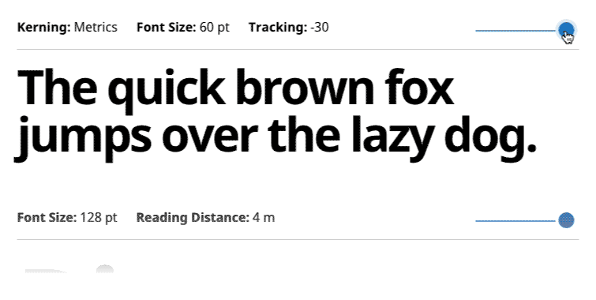

# Font Slider

Simple module for displaying text with variable styles applied (font size, line-height etc).

### Config

Include slider.css and slider.js. See [demo.html](demo.html) for example HTML snippets.

Add variables and styles width data attributes:
```
data-initial
data-fields
data-values
data-styles
```
